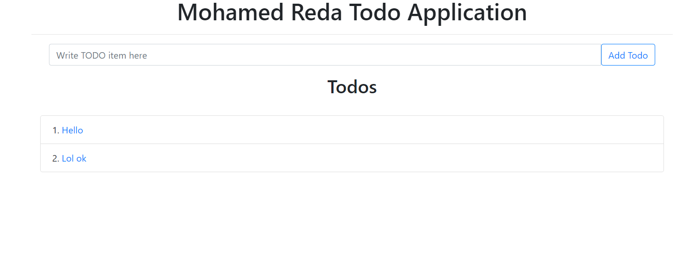
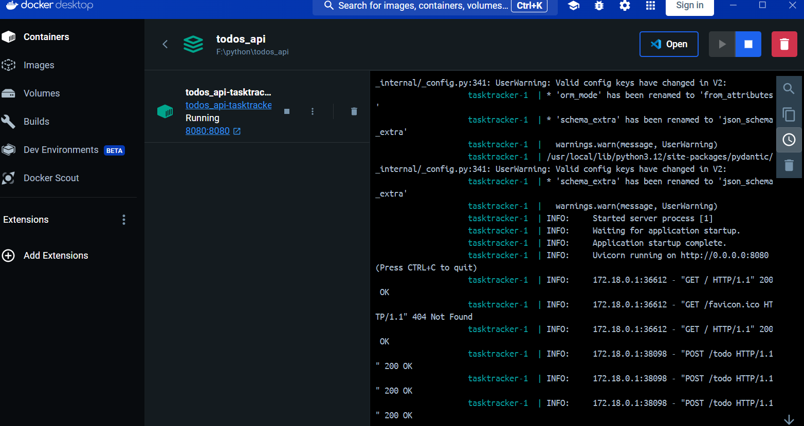

# TaskTracker: A FastAPI Todo Application

TaskTracker is a simple yet powerful todo application built with FastAPI. It allows users to create, retrieve, update,
and delete tasks. The application also supports form data submission and renders HTML templates for displaying tasks.





### Prerequisites

- Python 3.7+
- pip (Python package installer)

### Install Dependencies

```bash
pip install -r requirements.txt
```

The application will be available at `http://127.0.0.1:8080`.

## API Endpoints

### Add a New Task

- **URL**: `/todo`
- **Method**: `POST`
- **Request**:
    - Form data: `item`

### Retrieve All Tasks

- **URL**: `/todo`
- **Method**: `GET`

### Retrieve a Single Task by ID

- **URL**: `/todo/{todo_id}`
- **Method**: `GET`
- **Path Parameter**: `todo_id` (integer)

### Update a Task by ID

- **URL**: `/todo/{todo_id}`
- **Method**: `PUT`
- **Path Parameter**: `todo_id` (integer)
- **Request**:
    - JSON body: `{ "item": "updated task description" }`

### Delete a Single Task by ID

- **URL**: `/todo/{todo_id}`
- **Method**: `DELETE`
- **Path Parameter**: `todo_id` (integer)

### Delete All Tasks

- **URL**: `/todo`
- **Method**: `DELETE`

## Directory Structure

```
tasktracker/
├── api.py
├── model.py
├── todo.py
├── templates/
│   └── home.html
│   └── todo.html
├── requirements.txt
└── README.md
```

- `app.py`: The main entry point of the application.
- `model.py`: Contains the Pydantic models used in the application.
- `todo.py`: Contains the API routes and business logic for managing tasks.
- `templates/`: Directory containing HTML templates.
- `requirements.txt`: List of dependencies required for the application.
- `README.md`: This readme file.

## Dependencies

- FastAPI
- Pydantic
- Uvicorn
- Jinja2

To Build the Docker Image:

```bash
docker build -t tasktracker:latest .
```

To Run the Docker Container

```bash
docker run -d -p 8080:8080 tasktracker:latest
```

then You can run it from Docker (make sure that Docker installed and works before running these
commands)

## Acknowledgments

- [FastAPI](https://fastapi.tiangolo.com/)
- [Pydantic](https://pydantic-docs.helpmanual.io/)
- [Uvicorn](https://www.uvicorn.org/)

----------------

to check which program are running at port 8000

```bash
netstat -aon | findstr :8000  
```
